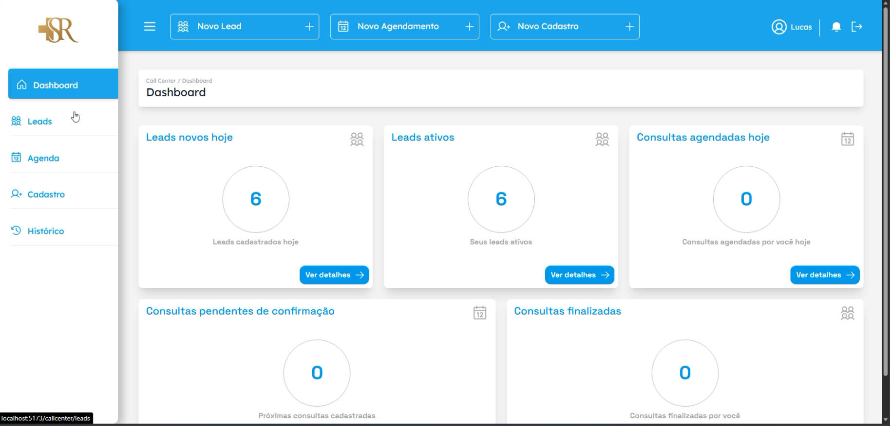
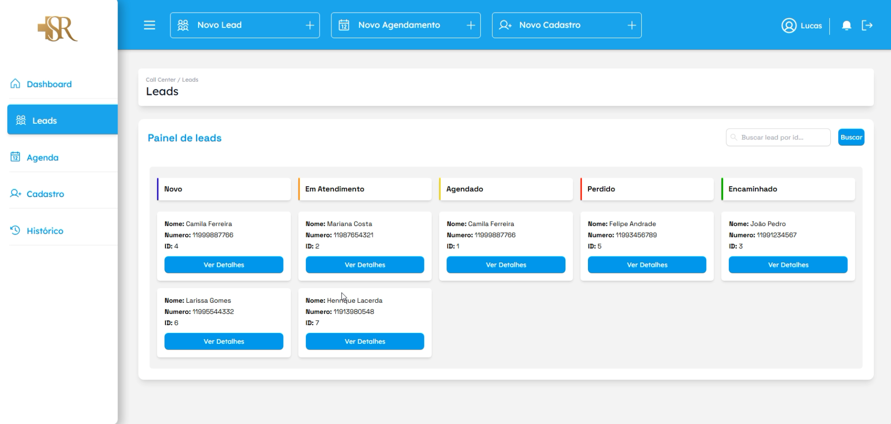
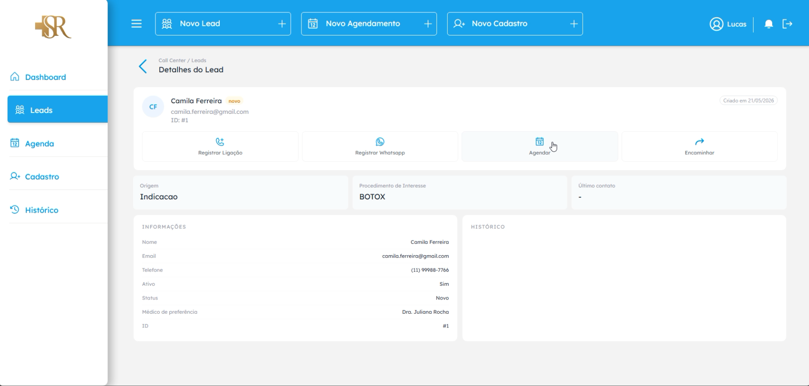
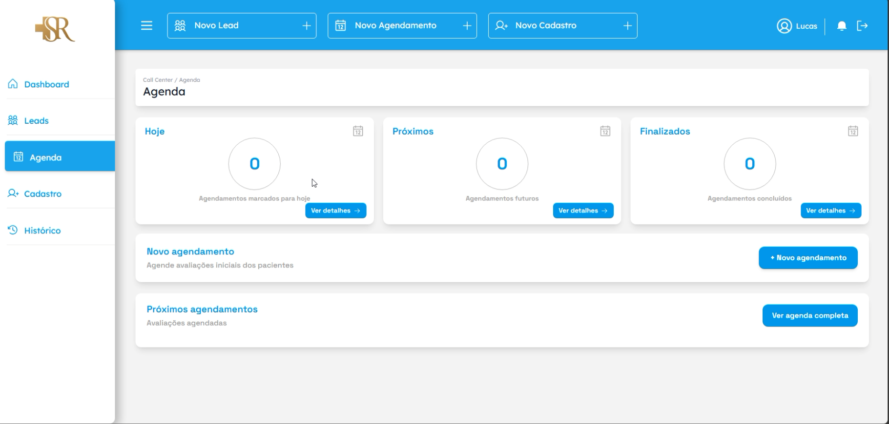
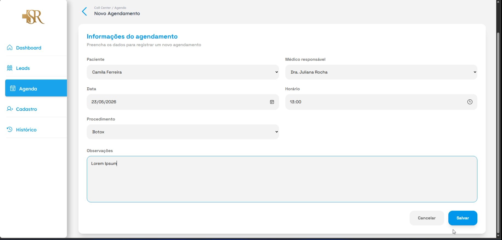
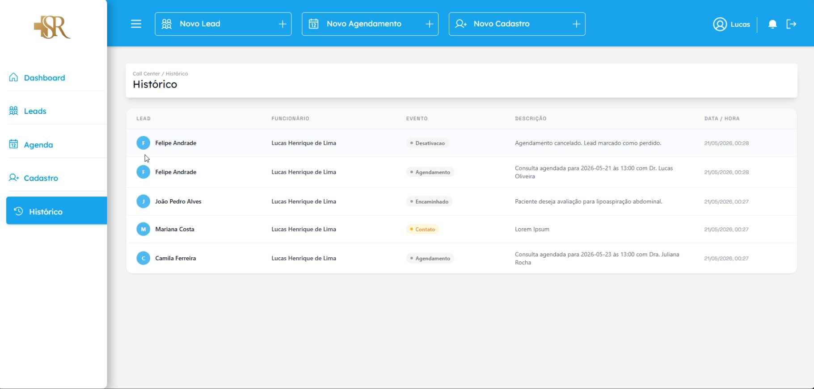

# CRM Hospital São Rafael

Sistema para captação, distribuição e acompanhamento de leads, registro de contatos e gerenciamento de agendamentos do Hospital São Rafael.

## Visão da aplicação

### Dashboard do call center

O painel inicial reúne os principais indicadores da operação e oferece atalhos para cadastro de leads e agendamentos.



### Gestão de leads

Os leads são organizados visualmente por etapa do atendimento. A tela de detalhes concentra os dados do paciente e as ações de contato, agendamento e encaminhamento.

| Painel de leads | Detalhes do lead |
|---|---|
|  |  |

### Agenda

A agenda separa os atendimentos do dia, próximos e finalizados. O formulário permite escolher paciente, médico, data, horário e procedimento.

| Visão da agenda | Novo agendamento |
|---|---|
|  |  |

### Histórico de atendimento

O histórico registra os eventos do lead, o funcionário responsável, a descrição e a data de cada ação.



## Funcionalidades

- Autenticação com JWT e perfis `ADMIN`, `CALL_CENTER` e `RECEPCAO`.
- Cadastro e ativação/desativação de funcionários.
- Cadastro e distribuição circular de leads entre operadores ativos do call center.
- Registro de contatos e histórico dos leads.
- Encaminhamento e encerramento de leads.
- Cadastro e consulta de médicos.
- Criação, edição, filtragem e cancelamento de agendamentos.
- Indicadores de leads e agenda por funcionário.

## Tecnologias

### Frontend

- React 19, Vite 7 e React Router
- Axios e Tailwind CSS
- Headless UI, Framer Motion, dnd-kit, SweetAlert2 e Lucide React

### Backend

- Java 21 e Spring Boot 4
- Spring MVC, Data JPA e Security
- JWT, PostgreSQL, H2, Thymeleaf, Maven e Lombok

## Estrutura

```text
Hospital São Rafael/
├── crm-hsr-front-main/    # Interface React
└── crm-hsr-back-main/     # API Spring Boot
```

## Pré-requisitos

- Java 21
- PostgreSQL
- Node.js 20.19+ ou 22.12+
- npm

O Maven Wrapper já está incluído no backend.

## Configuração do backend

Crie o banco local:

```sql
CREATE DATABASE "crm-saorafael";
```

Defina as variáveis de ambiente antes de iniciar a API. No PowerShell:

```powershell
$env:DB_URL = "jdbc:postgresql://localhost:5432/crm-saorafael"
$env:DB_USERNAME = "postgres"
$env:DB_PASSWORD = "sua-senha-do-postgres"
$env:JWT_SECRET = "uma-chave-segura-com-pelo-menos-32-caracteres"
$env:JWT_EXPIRATION = "86400000"
```

`JWT_EXPIRATION` é informado em milissegundos. Não salve senhas ou a chave JWT no repositório.

### Primeiro administrador

Em um banco vazio, habilite o bootstrap somente na primeira execução:

```powershell
$env:BOOTSTRAP_ADMIN_ENABLED = "true"
$env:BOOTSTRAP_ADMIN_NAME = "Administrador"
$env:BOOTSTRAP_ADMIN_EMAIL = "admin@exemplo.com"
$env:BOOTSTRAP_ADMIN_PASSWORD = "uma-senha-inicial-segura"
$env:BOOTSTRAP_ADMIN_BIRTH_DATE = "2000-01-01"
```

O bootstrap não substitui um usuário já existente. Depois da criação inicial, desative-o:

```powershell
$env:BOOTSTRAP_ADMIN_ENABLED = "false"
```

## Execução

### Backend

Windows:

```powershell
cd crm-hsr-back-main
.\mvnw.cmd spring-boot:run -Dspring-boot.run.profiles=dev
```

Linux ou macOS:

```bash
cd crm-hsr-back-main
./mvnw spring-boot:run -Dspring-boot.run.profiles=dev
```

A API será iniciada em `http://localhost:8080`.

### Frontend

```bash
cd crm-hsr-front-main
cp .env.example .env
npm install
npm run dev
```

No PowerShell, substitua o comando de cópia por `Copy-Item .env.example .env`. A interface será iniciada normalmente em `http://localhost:5173`.

Para apontar o frontend para outra API, altere `VITE_API_URL` no arquivo `.env`.

## Autenticação e permissões

O login é realizado em `POST /auth/login`. Nas demais rotas protegidas, envie o token no cabeçalho:

```text
Authorization: Bearer <token>
```

O cadastro público de leads (`POST /api/leads`) permanece aberto para integrações. As demais operações exigem autenticação e respeitam o perfil do funcionário.

Quando um administrador cadastra um funcionário, a senha temporária é exibida uma única vez na interface. Ela não é gravada nos logs nem retornada nas consultas posteriores.

## Principais recursos da API

| Recurso | Prefixo |
|---|---|
| Autenticação | `/auth` |
| Leads | `/api/leads` |
| Histórico de leads | `/api/leads/historico` |
| Funcionários | `/api/funcionarios` |
| Agendamentos | `/api/agendamento` |
| Médicos | `/api/medicos` |
| Registros de contato | `/api/contatos` |

## Qualidade

Backend:

```powershell
cd crm-hsr-back-main
.\mvnw.cmd test
```

Frontend:

```bash
cd crm-hsr-front-main
npm run lint
npm run build
```

## Autores

**Stack Society**

- Vitor de Lima Domingues
- Giovanni Romano Provazi
- Caio Berardo de Araújo
- Matheus Machado Caposse
